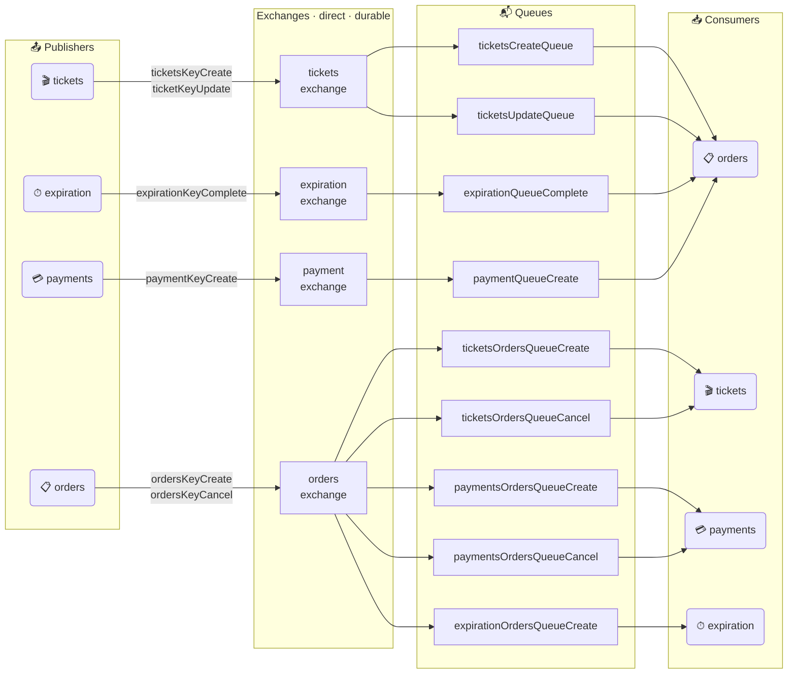
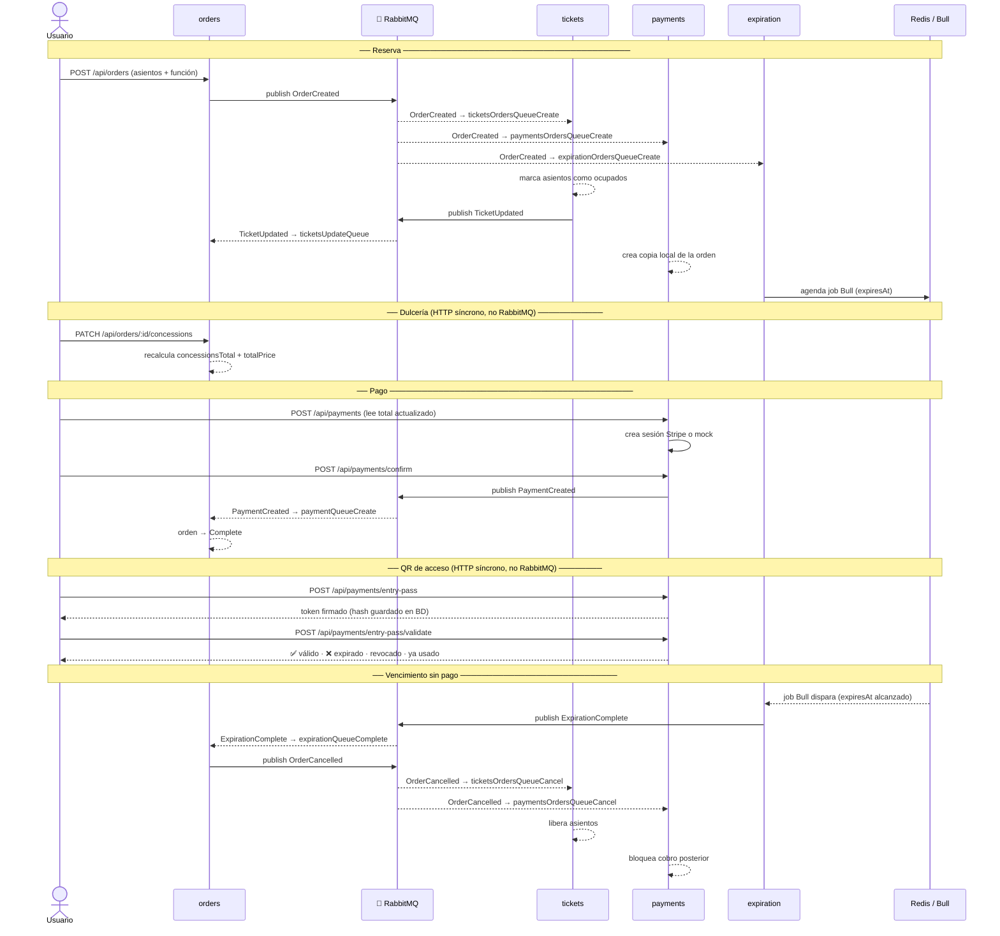

<div align="center">


# 🎬 CineMax · Ticketing Platform

**Plataforma de cartelera, reservas, pagos y check-in QR construida sobre microservicios event-driven.**

---

### Stack principal


</div>

---

## ¿Qué es CineMax?

CineMax es una plataforma de cine end-to-end: cartelera, selección de asientos, dulcería, pago con Stripe y entrada QR. Cada pieza del negocio vive en su propio microservicio con su propia base de datos. **RabbitMQ es el tejido que los conecta sin que ninguno dependa directamente del otro.**

---

## Arquitectura de microservicios

```
┌─────────────────────────────────────────────────────────────┐
│                      Browser / Cliente                      │
└──────────────────────────┬──────────────────────────────────┘
                           │ HTTP
┌──────────────────────────▼──────────────────────────────────┐
│                   Gateway  (Nginx / Ingress)                │
└──┬─────────────┬──────────────┬───────────────┬─────────────┘
   │             │              │               │
   ▼             ▼              ▼               ▼
┌──────┐   ┌─────────┐   ┌─────────┐   ┌──────────┐
│ auth │   │ tickets │   │ orders  │   │ payments │
│      │   │         │   │         │   │          │
│ JWT  │   │ MongoDB │   │ MongoDB │   │ MongoDB  │
│ hCap │   │ tickets │   │ orders  │   │ payments │
└──────┘   └────┬────┘   └────┬────┘   └────┬─────┘
                │              │              │
                └──────────────┼──────────────┘
                               │
                    ┌──────────▼──────────┐
                    │      RabbitMQ       │
                    │  direct exchanges   │
                    │  durable queues     │
                    └──────────┬──────────┘
                               │
                    ┌──────────▼──────────┐
                    │     expiration      │
                    │   Bull + Redis      │
                    └─────────────────────┘
```

Cada servicio tiene su propia base de datos MongoDB. **No hay base compartida.** La sincronización de estado entre bounded contexts es exclusivamente por eventos.

---

## 🐇 RabbitMQ: el núcleo del sistema

### Mapa completo de exchanges, colas y consumidores



> Cada consumidor tiene su propia cola. Esto garantiza fan-out por servicio sin que dos consumidores compitan por el mismo mensaje.

---

### Flujo de negocio de punta a punta



---

### Tabla de eventos

| Evento | Publica | Consume | Efecto |
|---|---|---|---|
| `TicketCreated` | `tickets` | `orders` | orders proyecta catálogo localmente |
| `TicketUpdated` | `tickets` | `orders` | orders sincroniza cambios de asiento |
| `OrderCreated` | `orders` | `tickets` · `payments` · `expiration` | ocupa asiento · crea copia pagable · agenda vencimiento |
| `OrderCancelled` | `orders` | `tickets` · `payments` | libera asiento · bloquea cobro |
| `PaymentCreated` | `payments` | `orders` | cierra la orden como `Complete` |
| `ExpirationComplete` | `expiration` | `orders` | dispara cancelación → `OrderCancelled` en cadena |

### Lo que intencionalmente NO pasa por RabbitMQ

| Operación | Por qué es HTTP síncrono |
|---|---|
| Login / refresh de sesión | requiere respuesta inmediata al usuario |
| `PATCH /concessions` | el monto a cobrar debe estar sincronizado al instante |
| Fetch del total antes del checkout | payments necesita el snapshot más reciente |
| Emisión y validación del QR | la puerta necesita resultado transaccional en tiempo real |

---

## Stack completo

### Backend


### Mensajería y colas


### Frontend


### Bases de datos


### Infraestructura y despliegue


### Testing


---

## Levantar en local

```bash
cp .env.example .env
docker compose up --build
```

| Recurso | URL |
|---|---|
| App | `http://localhost:3000` |
| RabbitMQ Management UI | `http://localhost:15672` |

Credenciales del broker local: `app-user / app-password`

Variables mínimas en `.env`:

```env
JWT_KEY=cualquier-string-secreto
ADMIN_EMAIL=tu@correo.com
ENTRY_PASS_SECRET=otro-string-secreto
```

Para inspeccionar el broker en Kubernetes:

```bash
kubectl port-forward svc/rabbit-srv 15673:15672
# → http://localhost:15673
```

---

## Estructura del repositorio

```
.
├── auth/           sesiones, refresh tokens, roles efectivos
├── client/         frontend React / Vite
├── expiration/     worker Bull + Redis para vencimiento de órdenes
├── infra/
│   ├── docker/     nginx local para Compose
│   └── k8s/        manifests Kubernetes + RabbitmqCluster
├── orders/         reservas, dulcería, dashboard admin
├── payments/       checkout, confirmación, QR y check-in
└── tickets/        catálogo, funciones, estado de asientos
```

---

## Panel admin

| Ruta | Descripción |
|---|---|
| `/admin/orders` | KPIs de revenue, attach rate de dulcería, breakdown por estado / cine / formato, top películas, top productos, exportes PDF y Excel |
| `/admin/check-in` | Consola QR: cámara, upload de imagen, validación manual, reemisión, revocación e historial |

---

## Tests

```bash
cd auth     && npm run test:ci
cd orders   && npm run test:ci
cd tickets  && npm run test:ci
cd payments && npm run test:ci
```
