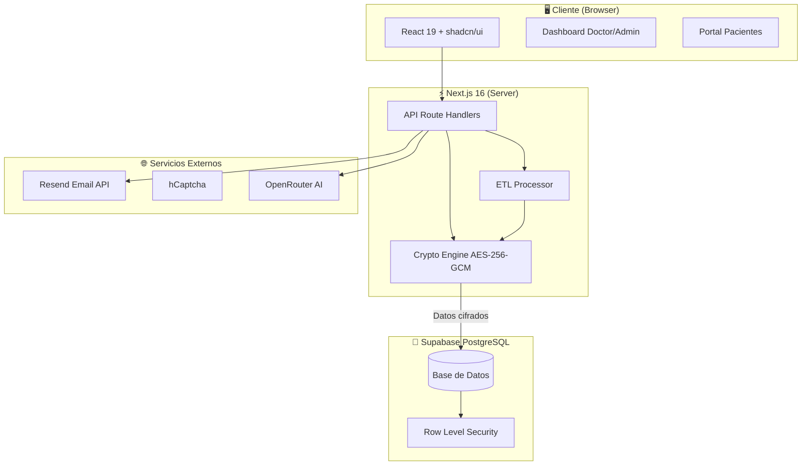
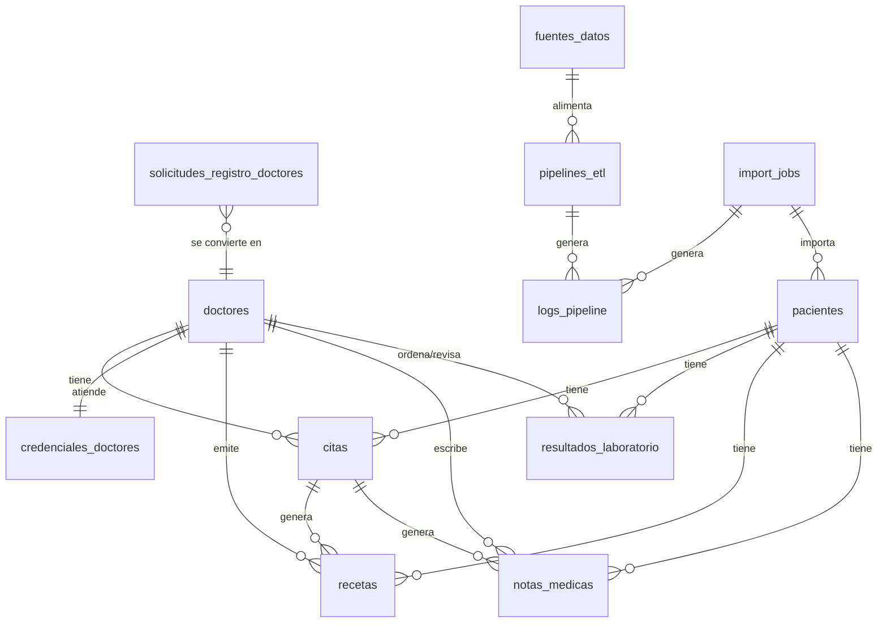

# MedComLabs — Gestión Moderna de ETL y Cifrado de Base de Datos

> Plataforma hospitalaria con ETL avanzado y cifrado AES-256-GCM de extremo a extremo

---

## Descripción General

MedComLabs es un sistema hospitalario moderno que integra:
- **ETL (Extract, Transform, Load)** para importación y procesamiento masivo de datos clínicos
- **Cifrado AES-256-GCM** en toda la capa de datos sensibles (pacientes, doctores, resultados, recetas, notificaciones)
- **Notificaciones y resultados por email** usando Resend
- **Gestión de usuarios, autenticación JWT, y seguridad avanzada**

---

## Stack Tecnológico

- **Frontend:** Next.js 16 (App Router), React 19, TypeScript 5, Tailwind CSS 4, shadcn/ui, Remotion
- **Backend:** Next.js API Routes, Web Crypto API (AES-256-GCM, PBKDF2), Resend (email), OpenRouter y DeepSeek (IA médica)
- **Base de Datos:** Supabase (PostgreSQL 15+), RLS, JSONB, triggers, extensiones pgcrypto/uuid-ossp
- **Seguridad:** JWT, hCaptcha, rate limiting, auditoría, RLS, bcrypt

---

## Arquitectura General



---

## Base de Datos — PostgreSQL (Supabase)

- **16 tablas principales**: pacientes, doctores, credenciales, citas, resultados, recetas, notificaciones, logs, ETL, etc.
- **Cifrado AES-256-GCM**: Todos los datos sensibles se almacenan cifrados (nombre, email, teléfono, resultados, etc.)
- **Hash SHA-256**: Columnas hash paralelas para búsquedas eficientes sobre datos cifrados
- **RLS**: Row Level Security en todas las tablas
- **JSONB**: Uso extensivo para resultados, medicamentos, logs
- **Triggers**: Actualización automática de timestamps

### Ejemplo de Cifrado

- Dos columnas: `nombre_encrypted` + `nombre_iv` (pacientes, doctores)
- Empaquetado: `iv.ciphertext` (citas, solicitudes, notificaciones)
- Hash: `cedula_hash`, `numero_licencia_hash`, etc.

---

## Diagrama Entidad-Relación de la Base de Datos



---

## ETL y Procesamiento de Datos

- **Importación masiva** de pacientes desde CSV/JSON/Excel
- **Deduplicación** por hash de cédula
- **Cifrado automático** en el pipeline ETL
- **Tracking y logs** de cada importación
- **Pipelines configurables** para otras fuentes de datos

### Flujo ETL

1. Admin sube archivo CSV/JSON
2. El sistema valida, deduplica y cifra cada registro
3. Inserta en la base de datos cifrada
4. Registra logs y métricas de importación

---

## Seguridad y Autenticación

- **JWT Access/Refresh Tokens** (HS256, HttpOnly cookies)
- **hCaptcha** en registro de doctores
- **Rate limiting** por acción y usuario
- **Auditoría completa** de eventos críticos
- **Hashing de contraseñas** con bcrypt
- **RLS**: Políticas estrictas en todas las tablas

---

## Notificaciones y Resultados por Email

- **Resend API** para envío de resultados y recetas médicas
- **Correos HTML personalizados** con branding institucional
- **Notificaciones internas** para doctores y pacientes

---

## Variables de Entorno Clave

```env
ENCRYPTION_SECRET=clave-secreta-para-aes-256-gcm
RESEND_API_KEY=re_xxx
EMAIL_FROM=MedComLabs <onboarding@resend.dev>
SUPABASE_SERVICE_ROLE_KEY=eyJ...
NEXT_PUBLIC_SUPABASE_URL=https://xxx.supabase.co
NEXT_PUBLIC_SUPABASE_ANON_KEY=eyJ...
JWT_SECRET=clave-secreta-jwt-access
JWT_REFRESH_SECRET=clave-secreta-jwt-refresh
```

---

## API Routes — Mapa Completo

```
/api
├── admin/
│   ├── notifications/       GET (listar), POST (crear)
│   ├── reset-password/      POST (resetear contraseña de doctor)
│   └── users/               GET (listar doctores con credenciales)
│
├── ai/
│   ├── actions/             POST (acciones IA)
│   └── chat/                POST (chat con asistente médico)
│
├── appointments/
│   ├── route.ts             GET (listar), POST (crear cita pública)
│   └── [id]/route.ts        GET, PATCH (actualizar), DELETE
│
├── auth/
│   └── login/               POST (login admin)
│
├── doctor-registrations/
│   ├── route.ts             GET (admin: listar), POST (público: solicitar)
│   └── [id]/route.ts        PATCH (aprobar/rechazar)
│
├── doctors/
│   ├── route.ts             GET (listar doctores)
│   ├── [id]/route.ts        GET, PATCH, DELETE
│   ├── [id]/appointments/
│   │   ├── cancel-all/      PATCH
│   │   ├── pending/         GET
│   │   └── reassign/        PATCH
│   ├── appointments/
│   │   ├── route.ts         GET, PATCH (doctor autenticado)
│   │   └── reschedule/      PATCH
│   ├── auth/
│   │   ├── login/           POST
│   │   ├── refresh/         POST
│   │   └── register/        POST
│   ├── dashboard/           GET (datos agregados)
│   ├── lab-results/
│   │   ├── route.ts         GET, POST, PATCH, DELETE
│   │   └── [id]/review/     PATCH
│   ├── notifications/       GET, PATCH (marcar leída)
│   ├── patients/[id]/
│   │   ├── route.ts         GET, PATCH
│   │   └── results/         GET
│   ├── prescriptions/
│   │   ├── route.ts         GET, POST, PATCH, DELETE
│   │   └── send/            POST (enviar por email)
│   ├── profile/             GET, PATCH
│   ├── public/              GET (doctores públicos para citas)
│   ├── results/
│   │   ├── route.ts         POST (crear resultado)
│   │   ├── send/            POST (enviar por email)
│   │   └── [id]/pdf/        GET (generar PDF)
│
├── etl/
│   ├── data-sources/        GET, POST
│   ├── pipelines/           GET, POST
│   ├── process/             POST (ejecutar pipeline)
│   └── stats/               GET (métricas)
│
├── results/
│   ├── route.ts             POST (consulta pública por cédula+código)
│   ├── [id]/route.ts        GET
│   └── download/            GET (HTML para print-to-PDF)
│
└── security-logs/           GET (admin: consultar logs)
```

---

## Seguridad API y Hardening

### Medidas de Hardening Aplicadas
- **Cifrado AES-256-GCM** en tránsito y en reposo para todos los datos sensibles
- **JWT (HttpOnly, HS256)** para autenticación y autorización
- **Rate limiting** por usuario/IP en endpoints críticos
- **hCaptcha** en flujos de registro público
- **RLS (Row Level Security)** en la base de datos: cada consulta sólo accede a datos permitidos
- **Auditoría de eventos**: logs de acceso, cambios y operaciones sensibles
- **Validación estricta** de payloads y sanitización de entradas
- **Cabeceras de seguridad** (CORS, CSP, HSTS, X-Content-Type-Options, etc.)
- **Protección contra brute force** en login y registro
- **Hashing de contraseñas** con bcrypt
- **Despliegue en entorno aislado** y sin exposición de claves en frontend

### Rutas Protegidas vs Públicas

| Ruta                                 | Método(s)         | Acceso         | Protección           |
|--------------------------------------|-------------------|----------------|---------------------|
| /api/doctors/auth/login              | POST              | Público        | Rate limit, hCaptcha|
| /api/doctors/auth/register           | POST              | Público        | hCaptcha, RLS       |
| /api/doctor-registrations/           | POST              | Público        | hCaptcha, RLS       |
| /api/appointments/                   | GET, POST         | Público        | Rate limit, RLS     |
| /api/results/route.ts                | POST              | Público        | RLS, hash lookup    |
| /api/doctors/                        | GET, PATCH, DELETE| Protegido      | JWT, RLS            |
| /api/doctors/prescriptions/          | GET, POST, PATCH  | Protegido      | JWT, RLS, audit     |
| /api/doctors/prescriptions/send/     | POST              | Protegido      | JWT, audit, Resend  |
| /api/doctors/lab-results/            | GET, POST, PATCH  | Protegido      | JWT, RLS, audit     |
| /api/doctors/notifications/          | GET, PATCH        | Protegido      | JWT, RLS            |
| /api/admin/*                         | GET, POST         | Protegido      | JWT (admin), audit  |
| /api/etl/*                           | GET, POST         | Protegido      | JWT (admin), audit  |
| /api/security-logs/                  | GET               | Protegido      | JWT (admin), audit  |

- **Protegido**: Requiere JWT válido, y en algunos casos rol de admin.
- **Público**: Acceso sin autenticación, pero con controles de rate limit, hCaptcha y RLS.

> Todas las rutas que exponen o modifican datos sensibles requieren autenticación y pasan por políticas de RLS y auditoría. Las rutas públicas sólo permiten operaciones de registro, login, consulta de citas y resultados, siempre con controles de seguridad y sin exponer datos confidenciales.

---

> MedComLabs — Gestión hospitalaria moderna con ETL y cifrado de base de datos.
