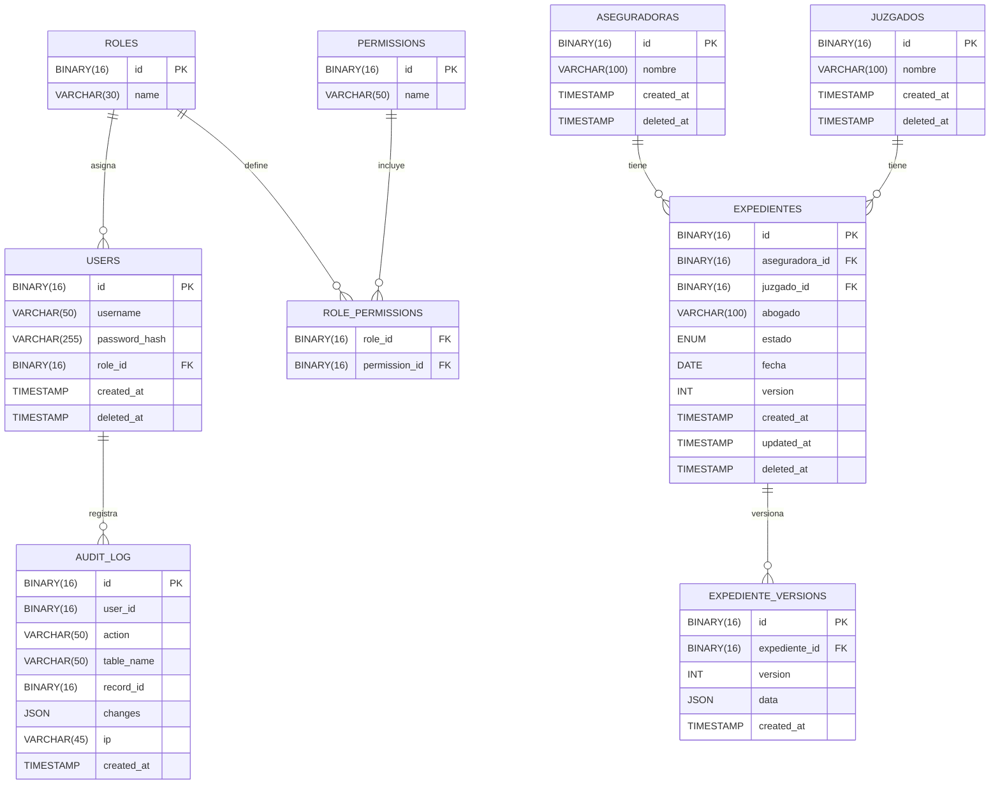

# Legalia - Sistema de Gestion de Expedientes

Sistema web para gestion de expedientes legales, agenda diaria y administracion de aseguradoras y juzgados.

## Screenshot del Website


## Requisitos

- Docker Desktop
- Docker Compose (incluido con Docker Desktop)

## Despliegue rapido (Docker)

1. Levanta los servicios:
   ```
   docker compose up --build
   ```

2. Accede a la web:
   - Login: `http://localhost:8080/login.html`
   - App principal: `http://localhost:8080/index.html`

3. Accede a la API:
- Swagger: `http://localhost:5001/apidocs`
- Health: `http://localhost:5001/api/health`
- Reportes API: `GET /api/reports/summary`
- Validacion de sesion: `GET /api/me`

## Credenciales iniciales

- Usuario: `admin`
- Contrasena: `admin123`

Estas credenciales se crean automaticamente al iniciar el backend. Puedes cambiarlas en `docker-compose.yml` usando `ADMIN_USERNAME` y `ADMIN_PASSWORD`.

## Puertos usados

- Frontend: `8080`
- Backend API: `5001`
- MariaDB: `3308`

## Datos de ejemplo

Al iniciar el backend por primera vez (o si la base esta vacia), se crean:

- Aseguradoras de ejemplo
- Juzgados de ejemplo
- 3 expedientes de ejemplo con la fecha del dia

Si ya tienes una base con datos, el seed no se repite.

Para reiniciar la base y recargar los datos de ejemplo:
```
docker compose down -v
docker compose up --build
```

## Flujo de uso

1. Abre `http://localhost:8080/login.html`.
2. Inicia sesion con el usuario `admin`.
3. Usa el boton `+` para crear expedientes.
4. Desde el menu lateral puedes abrir los modales de Aseguradora y Juzgado para agregar catalogos.
5. En los modales puedes editar o eliminar registros existentes (con ID visible para diferenciar duplicados).
6. En `Reportes` veras estadisticas reales por estado, aseguradora y juzgado.
7. La agenda se alimenta automaticamente con los expedientes del dia y el calendario es interactivo.

## Configuracion recomendada

- Cambia `JWT_SECRET` por un valor de 32+ caracteres para mayor seguridad.
- Cambia `ADMIN_PASSWORD` en `docker-compose.yml`.
- Mantener CSP habilitado (ver `CSP_ENABLED`) para seguridad en frontend y Swagger.

Si Swagger no carga en tu navegador por politicas CSP, puedes desactivar CSP:

```
CSP_ENABLED=0
```

en el servicio `backend` dentro de `docker-compose.yml`.

## Base de datos (SQL)

- Script unico y fuente de verdad: `docker/init.sql`
- El contenedor de MariaDB crea las tablas reales desde `docker/init.sql` en el primer arranque.

## Diagrama Entidad-Relacion (ER)



## PyMySQL

La conexion a MariaDB se hace con PyMySQL en:

- `backend/app/database.py`

```python
import pymysql

def get_db():
    return pymysql.connect(
        host=Config.DB_HOST,
        user=Config.DB_USER,
        password=Config.DB_PASS,
        database=Config.DB_NAME,
        cursorclass=pymysql.cursors.DictCursor,
        autocommit=True,
    )
```

## Features UI/UX

- Calendario interactivo con feedback al seleccionar un dia.
- Chart.js solo en el tab de reportes.
- Modales con validacion y mensajes de confirmacion.
- CRUD completo en Aseguradoras, Juzgados y Expedientes con acciones en tabla e IDs visibles.
- Tab de reportes funcional (estadisticas por estado, aseguradora y juzgado).
- Layout responsive y accesible.
- Tooltips y animaciones suaves con Tippy.js y Animate.css.
- Sidebar colapsable en desktop y deslizable en mobile.

## Hardening y validaciones

- Longitudes y tipos restringidos en SQL (CHECK, ENUM, NOT NULL).
- Sanitizacion y validacion en API (username, password, nombres, fechas).
- Consultas parametrizadas con PyMySQL.

## Estructura del proyecto

```
backend/
  app/
    main.py
    routes/
    security/
frontend/
  index.html
  login.html
  css/
  js/
docker/
  init.sql
docker-compose.yml
```

## Notas

- El backend usa PyMySQL con MariaDB.
- La UI es HTML/CSS/JS puro con FullCalendar y Chart.js.
